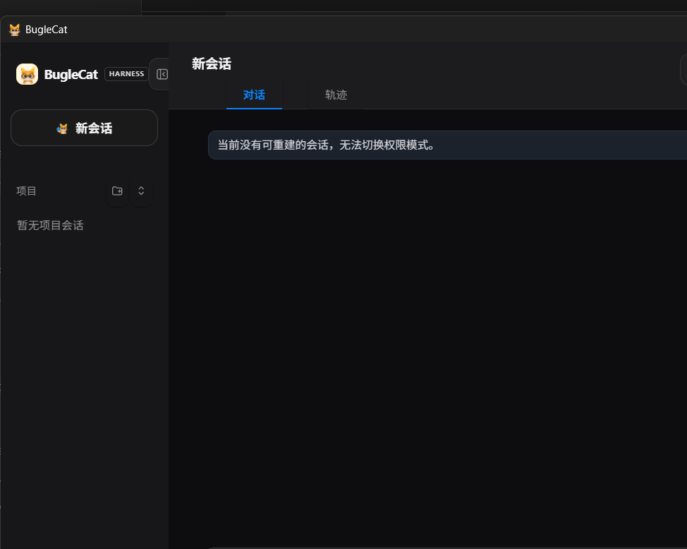

# BugleCat

English | [简体中文](README.zh-CN.md)

## Capability Page

[Open the capability page](nanocodex.html) · [BugleCat repository](https://github.com/dgy-github/BugleCat)

[Design brief PDF](docs/ai-coding-agent-design-brief.pdf) · [Design brief HTML](docs/ai-coding-agent-design-brief.html)

📖 **[设计理念手册（中文）](docs/design-philosophy.zh-CN.md)** — why the tiered orchestrator, recursive decomposition, tool-less reasoning nodes, progressive disclosure, vision routing, and the benchmark methodology are built the way they are.

🛡️ **[Context Compression Safety Protocol（中文）](docs/context-compression-safety-protocol.zh-CN.md)** — why coding agents can drift after context compaction, and how snapshots, decision provenance, Git evidence, and read-only recovery contain the risk.

[](nanocodex.html)

**BugleCat** is a local, extensible Codex-style coding agent for Windows. A
chat-completions model proposes tool calls, the agent runs sandboxed
file/shell tools, records the session, and loops until the task is done. It
runs against DeepSeek's hosted API or any OpenAI-compatible local model, and
ships with MCP integration, a skills system, a sandbox/approval state machine,
context compaction, token-cost accounting, a Windows GUI, a scheduler, and
git-worktree A/B comparison.

The project evolved from the original `nanocodex` prototype. That legacy name
still appears in compatibility paths, environment variables, and Python
commands so existing installations keep working. The project has two clear
stages. The important shift is not just "same
features in another language"; it is an architectural split and a release
performance upgrade.

## Project Phases

### Stage 1: Python Baseline

The Python implementation under `nanocodex/` is the original, legacy feature-complete
agent line. It was optimized for fast product exploration: prove the agent
loop, tool UX, approval model, and desktop workflows before locking the system
into a stricter runtime.

**Architecture**

- A Python package centered on a compact async agent loop: model call -> tool
  execution -> session update -> next model call.
- Tooling, provider, sandbox, MCP, skills, memory, scheduler, compaction, and
  GUI modules are easy to extend independently while the product surface is
  still changing.
- Runtime contracts are intentionally dynamic, which made it cheap to add
  features such as MCP marketplace entries, prompt enhancement, image input,
  session resume/fork, and A/B worktree comparison.
- The Windows GUI uses Tkinter, keeping the first desktop version dependency
  light and simple to debug.

**Performance and delivery profile**

- Best for iteration speed: no compile step, quick experiments, and a large
  offline test suite around mocked providers.
- 420 offline tests validate behavior without API keys or network calls.
- Runtime delivery still depends on a Python install, package environment, and
  import-time startup cost; desktop distribution is therefore less clean than a
  native binary.
- Dynamic boundaries are productive during exploration, but become harder to
  reason about as sandboxing, tool execution, memory, MCP, and parallel agent
  flows grow.

### Stage 2: Rust Rewrite

The Rust implementation under `rust/` is the current release line. It keeps the
Python tree intact while rebuilding the core as small crates plus a Tauri
desktop shell. The rewrite keeps the proven Python feature map, but changes the
internal shape so the project can ship as a smaller, faster, more predictable
tool.

**Architecture**

- The workspace is split by responsibility: `ncx-sandbox`, `ncx-config`,
  `ncx-provider`, `ncx-tools`, `ncx-core`, and `ncx-cli`.
- Core contracts are typed: provider responses, tool calls, sandbox decisions,
  session messages, memory entries, and orchestrator results cross crate
  boundaries explicitly.
- Tool execution is centralized behind `ToolContext` and `ToolRegistry`, so
  sandbox policy, approval policy, timeouts, search, and memory are attached at
  the boundary where actions actually happen.
- `AgentLoop` is assembled from replaceable model providers, named turn-context
  providers, a tool registry, tool middleware, and an injectable scheduler.
  The runtime still owns write barriers and routes every scheduled call through
  `ToolRegistry`, preserving middleware, approval, and sandbox enforcement.
- CLI, GUI, and orchestrated workers resolve budgets, context editing,
  concurrency, and model endpoints through the same `AgentRuntimeProfile`
  assembly path, preventing frontend-specific configuration drift.
- The orchestration layer adds task classification, main/fast model routing,
  isolated worker workspaces, verifier selection, and promotion of the winning
  worker back into the real workspace.
- Project memory is local to `.ncx/memory/LEARNINGS.md`; startup uses cheap
  heuristic deduplication, while `ncx --memory-merge` runs the more expensive
  LLM-backed consolidation only as an explicit maintenance command.
- The desktop line moves to Tauri v2 + Svelte 5, separating the native backend
  from the UI surface and preparing a smaller release bundle than the Python GUI
  path.

**Performance and delivery profile**

- The CLI builds to a native `ncx.exe`, so users do not need Python, virtual
  environments, or editable installs.
- CLI release builds use strip, LTO, size optimization, and the Windows MSVC target
  used by the desktop installer;
  the CLI package includes README, license, and config example files.
- Startup avoids Python interpreter/import overhead and is suitable for short
  one-shot commands as well as interactive REPL use.
- Typed ownership makes parallel worker isolation and result promotion easier
  to reason about without shared mutable state leaks.
- The workspace test suite covers provider and runtime contracts, sandbox and
  approval policy, tool scheduling and recovery, MCP replacement, persistent
  processes, LSP, raw PTY sessions, GUI assembly, and orchestration.

**Platform control-plane upgrades**

- **Task budget:** every model call receives a runtime budget note with current
  model-call, tool-call, and context limits; the loop stops cleanly when model
  or tool budgets are exhausted and backfills unanswered tool calls so the
  message history stays valid.
- **Context editing:** the full local session remains intact, but the provider
  sees a send-time edited view that compresses old tool results and drops older
  prefixes once the context budget is exceeded.
- **Tool search:** tools are registered into a catalog. Small registries expose
  all tools; larger registries expose core tools plus `tool_search`, and search
  hits are made visible in the next schema view. The default view admits up to
  16 schemas so a mixed task can expose LSP, background, and terminal tools in
  the same model turn.
- **Harness tool families:** the Rust runtime includes a real `rust-analyzer`
  LSP provider, bounded background processes with incremental output, and
  persistent ConPTY/PTY shells with raw stdin, cursor reads, resize, and close.
  Windows child processes are contained in Job Objects.
- **Tool recovery:** read-only tool failures are classified, transient failures
  may be retried once, and argument-compatible fallbacks are selected without
  bypassing middleware, approval, or sandbox enforcement.
- **Structured workspace inspection:** `list_directory` and `path_info` use
  native filesystem APIs, while `git_status` and `git_diff` expose fixed
  read-only Git operations. Agents do not need to compose `ls`, `dir`, `find`,
  or platform-specific shell probes just to inspect a workspace.
- **Semantic memory:** project memory retrieval now uses a hybrid lexical
  semantic ranker: keywords, tags, phrase matches, Jaccard similarity, recency,
  and a small domain synonym map for agent/runtime terms.
- **Deterministic hooks:** `[[hooks]]` can run project commands before or after
  matching tools and at turn lifecycle points. A failing `pre_tool` or
  `user_prompt` hook blocks the action; `post_tool` and `stop` output is
  appended for audit, formatting, and quality-gate workflows.
- **Checkpoint / restore:** the Rust CLI and Tauri GUI create file checkpoints
  before model turns. CLI exposes `/checkpoint`, `/checkpoints`, and
  `/restore <id>`; the GUI exposes a checkpoint panel for manual save, list, and
  restore.

### Why Rust For Stage 2

Rust was chosen because the second stage is about productizing the agent, not
only adding more features:

- **Architecture hardening:** the sandbox, approval engine, provider adapter,
  tool registry, memory store, and orchestrator now have explicit typed
  contracts instead of relying on Python's dynamic object boundaries.
- **Predictable action boundary:** file, shell, search, and memory operations
  all pass through one tool context, which keeps approval and sandbox checks
  close to execution.
- **Parallel orchestration:** isolated worker copies, verifier selection, and
  result promotion are safer when ownership is explicit and data movement is
  visible in the type system.
- **Runtime control plane:** task budgets, context editing, tool search, and
  semantic memory sit in the Rust runtime boundary rather than depending on
  model-side conventions alone.
- **Native release performance:** a small `ncx.exe` starts without interpreter
  setup, making one-shot CLI tasks feel immediate and making distribution much
  easier for Windows users.
- **Desktop packaging path:** Tauri provides a native shell with a web UI
  frontend, a better long-term packaging fit than growing the Tkinter prototype.

## Table of Contents

- [Project Phases](#project-phases)
- [Highlights](#highlights)
- [Architecture](#architecture)
- [Tools](#tools)
- [Install](#install)
- [Quick Start](#quick-start)
- [Configuration](#configuration)
- [Custom Slash Commands](#custom-slash-commands)
- [Local Model / OpenAI-Compatible Endpoint](#local-model--openai-compatible-endpoint)
- [Sandbox & Approval](#sandbox--approval)
- [MCP](#mcp)
- [Plugin Ecosystem](#plugin-ecosystem)
- [Skills](#skills)
- [Memory & AGENTS.md](#memory--agentsmd)
- [Sessions, Resume & History](#sessions-resume--history)
- [Context Compaction](#context-compaction)
- [Token Usage & Cost](#token-usage--cost)
- [Scheduler](#scheduler)
- [A/B Worktree Comparison](#ab-worktree-comparison)
- [GUI](#gui)
- [Tests](#tests)
- [Security Notes](#security-notes)

## Highlights

- **Codex-style agent loop** — streaming token output, multi-round tool calls,
  cancellation, and per-turn usage accounting.
- **DeepSeek + any OpenAI-compatible backend** — point `base_url` at the hosted
  API or a local server (vLLM, llama-server, LM Studio, …).
- **Sandbox & approval state machine** — three sandbox modes and four approval
  policies gate every file/shell/network action.
- **MCP integration + marketplace** — load servers from `mcp.toml`, or install
  from a built-in / remote catalog; tools retain the names supplied by their
  servers, and duplicate names are rejected.
  `/mcp reload` prepares and atomically swaps the active external tool set in
  the same process.
- **Plugin ecosystem** — install Codex-compatible resource plugins that bundle
  Skills, MCP servers, Apps, Hooks, and UI slots from local, Git, NPM, or
  community marketplaces, with compatibility checks and conflict blocking.
- **Pluggable Agent runtime** — model provider, turn context, tool registry,
  scheduler, middleware, and permission profile are explicit runtime seams;
  CLI and GUI share the same assembly contract.
- **Harness tools** — real LSP queries, bounded background jobs, persistent raw
  PTY sessions, structured workspace inspection, web tools, and session lookup.
- **Skills system** — user skills plus three built-in coding skills; only
  name + description are injected, bodies load on demand.
- **Custom slash commands** — prompt-backed project/user commands in
  `.nanocodex/commands`, with `.claude/commands` compatibility.
- **Persistent memory + AGENTS.md / CLAUDE.md** — durable notes plus layered
  project instructions injected each turn.
- **Cross-agent long-term memory plugin** — the bundled LLM Wiki example pairs
  an always-applied Skill with a local MCP service to recall user preferences
  and project snapshots across BugleCat and other Agent clients.
- **Browsable session history** — JSONL logs, full-transcript snapshots, resume,
  and fork.
- **Context compaction** — zero-cost deterministic digest or opt-in model
  summarizer, keyed to a token budget.
- **Cache-aware cost accounting** — real per-call usage priced against
  DeepSeek's hit/miss rates.
- **Adaptive reasoning effort** — the `auto` tier picks `max`/`high`/`low` from
  the request (multilingual keyword tables: EN / 中文 / 日本語).
- **Scheduler** — recurring/one-shot saved prompts with consecutive-failure
  auto-disable.
- **A/B worktree comparison** — run one prompt under two configs in isolated git
  worktrees, compare diff/cost/latency, adopt one side.
- **Prompt enhancement, image input, Chinese-first responses**, and a Tauri 2 +
  Svelte 5 desktop GUI for Windows.

## Architecture

```text
rust/
├── crates/
│   ├── ncx-config/        # layered config and runtime limits
│   ├── ncx-provider/      # replaceable OpenAI-compatible model boundary
│   ├── ncx-sandbox/       # policy and approval decisions
│   ├── ncx-tools/         # process executor, managed jobs, PTY, file tools
│   ├── ncx-mcp/           # MCP transport and external tool discovery
│   ├── ncx-core/          # AgentLoop, registry, context, middleware, scheduler
│   └── ncx-cli/           # one-shot and interactive front end
└── gui/
    ├── src/               # Svelte 5 desktop UI
    └── src-tauri/         # Tauri commands and shared runtime assembly

nanocodex/                 # Python reference/prototyping implementation
```

## Tools

The Rust registry exposes a task-relevant subset each turn. Core tools stay
visible; named matches and `tool_search` hints add specialized tools without
sending the entire catalog on every model call.

| Tool | Purpose |
| --- | --- |
| `shell` | Run a shell command, gated by the sandbox/approval policy. |
| `apply_patch` | Apply a Codex-style patch to create/edit/delete files. |
| `update_plan` | Maintain a visible step plan for multi-step tasks. |
| `read_file` | Read a file (or a line range) from the workspace. |
| `str_replace_editor` | Perform exact, approval-gated text edits. |
| `grep`, `grep_literal`, `glob` | Search source and paths without shell parsing. |
| `list_directory`, `path_info`, `git_status`, `git_diff` | Structured workspace inspection. |
| `web_search`, `web_fetch` | Search and fetch through configured network policy. |
| `lsp` | Query symbols, definitions, references, hover, and diagnostics. |
| `background_start/poll/stop/list` | Manage bounded background processes with incremental output. |
| `terminal_open/write/read/exec/resize/close/list` | Manage persistent raw PTY sessions. |
| `ask_user_question` | Pause for a GUI/CLI answer when the frontend supplies a handler. |
| `session_search`, `session_trace`, `session_event_read/search/trace` | Query saved session snapshots and redacted events. |
| `skill` | Load a discovered skill body on demand. |
| `remember` | Append a durable note to user memory. |
| `<tool>` (MCP) | A tool exposed by a connected MCP server, using its server-supplied name. |

## Install

Current Rust release line:

```powershell
cd path\to\BugleCat
rustup toolchain install stable-x86_64-pc-windows-msvc
cargo +stable-x86_64-pc-windows-msvc build --manifest-path rust\Cargo.toml -p ncx-cli --release

cd rust\gui
npm ci
npm run tauri:build
```

This requires the Rust toolchain and Node.js 18 or newer. The original Python
implementation remains available for reference and prototyping:

```powershell
python -m pip install -e ".[dev]"
```

The Python line requires Python 3.11 or newer.

## Quick Start

Rust CLI, current release line:

```powershell
cd rust
cargo run -p ncx-cli -- "summarize this repository"
cargo run -p ncx-cli
cargo run -p ncx-cli -- --resume
cargo run -p ncx-cli -- --history
cargo run -p ncx-cli -- --memory-merge

# Tauri desktop app
cd gui
npm ci
npm.cmd run tauri -- dev --target x86_64-pc-windows-msvc
```

Inside the Rust REPL, `/config` shows the resolved config file path, current
model/sandbox/approval values, and writable keys. `/config key=value` persists a
setting to `~/.nanocodex/config.toml`; restart the REPL for provider, model,
sandbox, or budget changes to affect the active session. `/usage` (or `/cost`)
shows raw token usage for the last turn and current REPL session.

Legacy Python CLI (the command name remains `nanocodex` for compatibility):

```powershell
# one-shot task
nanocodex "add a --json flag to the CLI"

# interactive, in the current directory
nanocodex --cd .

# with MCP servers enabled
nanocodex --mcp

# the GUI
nanocodex-gui --cd .
```

For the legacy Python GUI, Windows users can also double-click `nanocodex-gui.cmd` after installation, or
generate a Start-menu shortcut with `scripts/make-shortcut.ps1`.

## Configuration

Settings resolve in priority order:

```text
CLI flags > environment > ~/.nanocodex/config.toml > ~/.deepseek/config.toml > ~/.codex/config.toml > defaults
```

The real API key should stay outside the repository:

```powershell
$env:DEEPSEEK_API_KEY = "sk-..."
$env:NANOCODEX_API_KEY = "sk-..."
```

Or create `~/.nanocodex/config.toml`:

```toml
api_key = "sk-..."
base_url = "https://api.deepseek.com/v1"
model = "deepseek-chat"

sandbox_mode = "workspace-write"   # read-only | workspace-write | danger-full-access
approval_policy = "on-request"     # untrusted | on-failure | on-request | never
reasoning_effort = "auto"          # auto | low | high | max | off

# Optional
# context_token_budget = 512000
# context_window = 1048576
# max_iterations = 60
# max_tool_calls = 120
# max_parallel_tool_calls = 8  # valid range: 1..=128; read-only tools only
# context_edit_enabled = true
# context_edit_max_chars = 120000
# context_edit_keep_recent_messages = 30
# context_edit_max_tool_result_chars = 4000
# available_models = ["deepseek-chat", "deepseek-reasoner", "deepseek-v4-pro"]

# [[hooks]]
# event = "pre_tool"          # pre_tool | post_tool | user_prompt | stop
# matcher = "shell|apply_patch"
# command = "echo checking %NCX_HOOK_TOOL%"
# timeout_s = 10
```

Runtime control-plane settings can also be set with environment variables:
`NANOCODEX_MAX_ITERATIONS`, `NANOCODEX_MAX_TOOL_CALLS`,
`NANOCODEX_CONTEXT_EDIT_ENABLED`, `NANOCODEX_CONTEXT_EDIT_MAX_CHARS`,
`NANOCODEX_CONTEXT_EDIT_KEEP_RECENT`, and
`NANOCODEX_CONTEXT_EDIT_TOOL_RESULT_CHARS`. The Rust CLI also accepts
`--max-iterations`, `--max-tool-calls`, `--context-edit-max-chars`,
`--context-edit-keep-recent`, `--context-edit-tool-result-chars`, and
`--disable-context-edit`.

A full example lives in `config.example.toml`.

Hooks receive `NCX_HOOK_EVENT`, `NCX_HOOK_TOOL`, `NCX_HOOK_ARGS`,
`NCX_HOOK_RESULT`, and `NCX_HOOK_WORKSPACE` in their environment. Use
`pre_tool` for deterministic guards such as blocking risky shell commands,
`post_tool` for audit and formatting, `user_prompt` to block or annotate a
prompt before the model sees it, and `stop` for end-of-turn quality gates or
notifications. Claude-style event names such as `UserPromptSubmit`, `Stop`,
`PreToolUse`, and `PostToolUse` are accepted and normalized. Hooks run as local
subprocesses, so configure only commands you trust.

## Custom Slash Commands

Rust REPL can turn Markdown prompt templates into slash commands. Put project
commands in `.nanocodex/commands/<name>.md`; for Claude Code compatibility,
`.claude/commands/<name>.md` is also read. User commands live in
`~/.nanocodex/commands/<name>.md`, with `~/.claude/commands/<name>.md` as a
compatibility fallback.

```markdown
---
description: Review one file
---
Review `$ARGUMENTS[0]` for bugs, regressions, and missing tests.
```

In the REPL:

```text
/review rust/crates/ncx-core/src/session.rs
/project:review rust/crates/ncx-core/src/session.rs
/user:review rust/crates/ncx-core/src/session.rs
```

`/name` resolves project commands before user commands. Templates support
`$ARGUMENTS` for the raw argument string plus `$0`..`$9` and
`$ARGUMENTS[0]`..`$ARGUMENTS[9]` for simple positional arguments. If a command
template has no placeholders, the raw arguments are appended under an
`Arguments:` block. These commands expand to a normal user prompt; they do not
run local shell code by themselves.

## Local Model / OpenAI-Compatible Endpoint

nanocodex talks plain `/v1/chat/completions`, so any OpenAI-compatible server
works — vLLM, llama-server, LM Studio, Ollama's OpenAI shim, etc. Point
`base_url` at the server's `/v1` root. Most local servers ignore the API key,
but a non-empty placeholder is still required because the OpenAI SDK expects
one.

```toml
api_key = "local-dev-key"
base_url = "http://127.0.0.1:8005/v1"
model = "Qwen3.6-27B-Q4_K_M"
```

Quick connectivity check:

```powershell
curl http://127.0.0.1:8005/v1/models
```

Streaming has a bounded "response-header" timeout (default 45s, override with
`NANOCODEX_STREAM_OPEN_TIMEOUT_S`) so a stalled local server fails fast with a
clear hint instead of hanging the UI.

## Sandbox & Approval

Two orthogonal axes gate every action, mirroring Codex:

**Sandbox mode** — what's physically allowed:

| Mode | Reads | Writes | Network |
| --- | --- | --- | --- |
| `read-only` | anywhere | none | off |
| `workspace-write` | anywhere | workspace + writable roots + temp | off unless enabled |
| `danger-full-access` | anywhere | anywhere | on |

**Approval policy** — what to do when an action exceeds the sandbox:
`untrusted`, `on-failure`, `on-request`, `never`. The approval engine resolves
each escalation to `ASK` / `AUTO_APPROVE` / `AUTO_DENY`.

On Windows enforcement is **policy-level**: path checks and writable-root gating
happen at the tool boundary. It is not kernel isolation.

## MCP

MCP servers are opt-in and run **outside** the sandbox (they launch external
subprocesses). Configure them in `~/.nanocodex/mcp.toml`:

```toml
[mcp_servers.fetch]
command = "uvx"
args = ["mcp-server-fetch"]

[mcp_servers.filesystem]
command = "npx"
args = ["-y", "@modelcontextprotocol/server-filesystem", "D:\\projects"]
```

Then start with MCP enabled:

```powershell
nanocodex --mcp
```

The Rust `ncx` REPL can apply MCP config changes without restarting:

```text
/mcp reload
```

Reload prepares every configured server before replacing the active MCP tool
set. A failed server is skipped while the successfully prepared servers replace
the set; if every configured server fails, or a tool-name conflict is found,
the previous set stays active. An empty config removes all active MCP tools.

Each connected server has one background stdio reader. Responses are routed by
JSON-RPC request ID, so independent read calls can complete out of order without
being matched to the wrong tool call; EOF, write errors, and request timeouts
wake and clean up their pending requests. Calls for a server share a bounded
gate: at most four explicitly read-only calls are in flight, while a
side-effecting or unknown call takes the full gate and is exclusive. The gate is
per server, so a slow server does not serialize unrelated servers. Approval is
still checked before a side-effecting call acquires the gate.

The initialize handshake validates an explicitly returned MCP protocol version
before tools are registered. A server that omits the field (older compatible
implementations) remains accepted; an explicit incompatible or malformed value
fails only that server's startup.

Each server's tools retain the name supplied by that server. Tool-name conflicts
are rejected during the atomic reload, so choose distinct MCP tool names. A
**marketplace** adds one-click install from a built-in curated catalog or a
remote catalog (`NANOCODEX_MARKETPLACE_URL`); every entry funnels through the
same name-validation and dup-check as a hand-added server, and remote catalogs
are treated as untrusted data. See `mcp.example.toml` for more.

## Plugin Ecosystem

BugleCat supports two deliberately separated plugin forms:

- **Codex-compatible resource plugins** use `.codex-plugin/plugin.json` and can
  bundle Skills, MCP servers, Apps, Hooks, and interface contributions.
- **External process plugins** use `plugin.toml` and communicate across a
  process boundary. BugleCat does not load third-party DLL, SO, or DYLIB files
  into the application process.

A resource plugin can use this layout:

```text
my-plugin/
├── .codex-plugin/plugin.json
├── skills/<name>/SKILL.md
├── .mcp.json
├── .app.json
└── hooks/hooks.json
```

Plugins can be installed globally in `~/.ncx/codex-plugins` or per workspace in
`.ncx/codex-plugins`. A workspace plugin with the same ID overrides the global
copy. Marketplace discovery understands OpenAI Codex, Claude, and Cursor style
directories, plus DSH Community sources such as dshfind, DeepSeek 1024 Store,
and standard HTTPS catalogs. Install sources may be local paths, Git
repositories, or NPM packages; each candidate is staged and validated before
installation.

Optional resources are isolated during runtime discovery. A malformed or
unreadable plugin catalog, Hooks document, Apps document, or individual App is
reported and skipped without hiding valid resources from another plugin. The
explicit catalog-management command remains strict, so a maintainer can still
inspect and fix invalid manifests instead of having errors silently rewritten.

The settings UI previews requested capabilities and compatibility before
installing. If an enabled plugin already owns an overlapping capability, the
new installation is blocked instead of silently replacing it. Interface
plugins can contribute to the supported UI slots `settings.plugins.tab`,
`sidebar.footer.action`, and `shell.overlay`, while Harness diagnostics show the
capabilities mounted at runtime.

MCP and external attachment parsers remain disabled by default because they can
start subprocesses or send content to another service. Enable only plugins and
marketplace sources you trust. See
[`local-plugins/llmwiki-memory`](local-plugins/llmwiki-memory) for a working
plugin that ships a Skill and an MCP server together.

## Skills

Skills are reusable instruction documents, one folder each:

```text
~/.nanocodex/skills/<skill-name>/SKILL.md
```

Only each skill's **name and description** are injected into the system prompt;
the full body is read on demand, so a large library doesn't eat the context
window. The model can also create/read/delete user skills in-chat via the
`manage_skills` tool.

Minimal skill:

```markdown
---
name: code-review
description: Review code changes and focus on bugs, regressions, and missing tests.
---

# Code Review

Look for behavior regressions first, then missing tests, then maintainability.
```

The package ships three **read-only built-in skills** under
`nanocodex/builtin_skills/`:

- **code-review** — two-pass review (correctness, then cleanup), ranked by impact.
- **debug** — reproduce → localize → fix → verify; resist patching the first
  plausible line.
- **write-tests** — test observable behavior, one behavior per test, prefer pure
  functions over mocks.

A user skill of the same name shadows the built-in.

## Memory & AGENTS.md

Two complementary layers of persistent context, both injected each turn:

- **User memory** (`~/.nanocodex/memory.md`) — durable personal facts and
  preferences. Written by the `remember` tool, by typing `# something` in the
  GUI composer (quick-capture), or by hand. Wrapped in a `<user_memory>` block.
- **AGENTS.md / CLAUDE.md** — project instructions layered from
  `~/.codex/AGENTS.md` and `~/.claude/CLAUDE.md`, then every `AGENTS.md`,
  `CLAUDE.md`, and `.claude/CLAUDE.md` from the repo root down to the workspace,
  so nested directories refine their parents. Total size is capped so a huge
  file can't blow the context. Rust CLI, orchestrator workers, and the Tauri GUI
  all inject this block at session startup.

Memory is "who/what" (preferences, facts); skills are "how to do X";
AGENTS.md / CLAUDE.md are project-scoped guidance.

### LLM Wiki cross-agent long-term memory

[`local-plugins/llmwiki-memory`](local-plugins/llmwiki-memory) is an optional
local plugin that adds a more structured memory lifecycle. It combines an
`always_apply` Skill with one local MCP tool, using `D:\LLMWIKI` as the actual
memory store. `D:\llm-wiki-template` contains the protocol and initialization
template; it is not the live data directory.

After the plugin and its MCP server are enabled:

1. A new Agent session automatically recalls the user profile before handling
   the first business request.
2. Entering an existing project recalls only its short L1 project snapshot;
   historical sections load on demand instead of filling the context window.
3. While the MCP service is running, saved BugleCat sessions are collected
   incrementally into the L0 corpus, normally within about one minute. No new
   conversation or manual import is required.
4. Confirmed project decisions, progress, pending work, and verification
   evidence can be recorded at task handoff and recalled by later Agents.

The layers have different trust rules: L0 is collected conversation material;
L1 is a concise project memory with source references; L2 is the stable user
profile. New conversation text never changes L2 directly. Profile candidates
must meet the evidence threshold and remain pending until the user explicitly
approves them. Tokens, cookies, passwords, secrets, database credentials, and
sensitive business content must not be stored.

Long-term memory is a recovery aid, **not a source of code truth**. Repository
requirements, contracts, current files, Git diff, tests, and database state
must be checked again before an Agent modifies a project. If the MCP service is
unavailable, the current task continues with a visible warning rather than
blocking or silently writing the Wiki files directly.

## Sessions, Resume & History

- Every conversation is appended to a **JSONL session log** (base64 image data
  is redacted from the log to keep it small).
- A **global index** (`~/.nanocodex/sessions.jsonl`) holds one summary line per
  conversation, newest-first, for the GUI's history list.
- A **per-session snapshot** (`~/.nanocodex/snapshots/<id>.json`) freezes the
  full transcript so the detail view replays the real conversation, not a digest.
- The Rust CLI supports `--resume` to reload the workspace
  `.nanocodex/session.jsonl` before starting and `--history` to list recent
  global session summaries. The Tauri backend records the same snapshots after
  each GUI turn.
- Rust CLI and Tauri GUI save a workspace file checkpoint before each model
  turn. Use `/checkpoints` to list recent checkpoints, `/checkpoint <label>` to
  create one manually, and `/restore <id>` to restore files; the GUI has the
  same save/list/restore flow in its checkpoint panel. Restore first creates a
  safety checkpoint of the current state.
- The original Python GUI can **fork** a saved snapshot to branch a past
  conversation without mutating the source session.

## Context Compaction

Long conversations are folded to stay within a token budget while preserving the
system message and a recent tail (the tail always starts at a `user` message, so
no tool-call/result pair is split). Two strategies share one interface:

- **deterministic** (default, zero API cost) — the folded middle becomes a
  factual, rule-based digest.
- **summarizer** (opt-in, costs tokens) — a model call turns the middle into prose.

The trigger estimate uses a Chinese-leaning chars/token ratio so zh-heavy chats
don't compact too late.

In the Rust CLI, `/compact` materializes the active context-edit policy into the
live session and rewrites the workspace session log, so future turns and
`--resume` continue from the compacted history.

## Token Usage & Cost

The provider returns real `usage` per call, including DeepSeek's
cache-hit/miss split. In the Rust REPL, `/usage` and `/cost` show the last turn
and session total model calls, tool calls, prompt tokens, completion tokens, and
cache hit/miss tokens. The Rust command intentionally reports raw usage only;
`pricing.py` turns usage into a USD cost for the Python line:

- **Cache-aware** — a cache-hit input token is ~120× cheaper than a miss; each is
  billed at its own rate. When the split is absent, the whole prompt is billed at
  the miss rate so cost is never understated.
- **Honest about staleness** — prices are a hardcoded snapshot carrying a source
  and as-of date; an unknown model returns "cost unknown" rather than a wrong
  number.

## Scheduler

Save a prompt to run automatically — once at a future time or on an interval:

```powershell
nanocodex schedule add "run the tests" --at 2026-06-08T09:00:00
nanocodex schedule add "summarize new issues" --every 3600
nanocodex schedule list
nanocodex schedule run        # keep this running for tasks to fire
```

A task that fails repeatedly **auto-disables** after 5 consecutive failures
(success resets the counter; re-enabling clears it), so a broken task can't loop
forever. The agent can also manage tasks in-chat via `manage_schedule`.

## A/B Worktree Comparison

Run the **same prompt under two configurations** and compare the results without
risking your working tree. Each side runs in its own isolated **git worktree**,
so real `shell`/`apply_patch` edits never collide:

1. Pick two configs (model / reasoning effort / sandbox / approval).
2. nanocodex creates two worktrees from clean `HEAD` and runs the prompt in each,
   serially, with auto-approve scoped to the worktree.
3. You get a side-by-side comparison: diff, token cost, latency, iterations,
   stop reason.
4. **Adopt** one side (its diff is applied to the real workspace) or discard
   both; the worktrees are always cleaned up.

Requires a clean git workspace (no uncommitted changes); the entry is disabled
otherwise.

## BugleCat Desktop GUI

The BugleCat desktop uses Tauri 2 + Svelte 5 on Windows (`rust/gui`):

- Streaming chat with reasoning/answer separation and a Stop button.
- Project switcher, model switcher, and a multi-section Settings page.
- Browsable session history (click to replay a full transcript).
- File panel, prompt enhancement, image attachment, `#` quick-capture to memory,
  MCP controls, checkpoints, and permission modes.
- A movable sidebar, approval dialog, and real `ask_user_question` modal with
  choice, free-text, and cancel flows.
- Failed tool results are removed from the visible transcript while remaining
  available to the model and session log for recovery and diagnosis.

CLI and GUI derive provider, permission, budgets, context editing, concurrency,
and LSP attachment from the same `AgentRuntimeProfile` assembly path.

## Tests

Rust release line:

```powershell
cargo fmt --manifest-path rust\Cargo.toml --all -- --check
cargo clippy --manifest-path rust\Cargo.toml --workspace --all-targets --all-features -- -D warnings
cargo test --manifest-path rust\Cargo.toml --workspace --all-features

cd rust\gui
npm ci
npm audit
npm run build
npm run test:e2e:question
```

Python line:

```powershell
python -m pytest -q
```

The normal Rust and Python suites are deterministic and offline. Explicit live
acceptance runs cover `rust-analyzer`, external network providers, MCP hot
reload, and real model-driven combinations of LSP, background, and PTY tools.

### Reliability regressions and local development

The regression suite also protects the following boundaries:

- Read-only LLM Wiki memory actions remain available under
  `approval_policy=never`, while side-effecting MCP calls must return the
  explicit approval denial instead of being masked by compaction recovery.
- A malformed MCP resource, command, argument, or unavailable server only skips
  that plugin/server. Other valid servers still load. Explicit `./` paths resolve
  from the plugin root; escaping `../` paths are rejected, while bare arguments
  retain normal process CWD/PATH semantics.
- Optional Codex plugin resources follow the same isolation boundary: a broken
  Hooks/Apps document, unreadable catalog entry, or malformed individual App is
  logged and skipped while valid plugins and resources remain available. The
  explicit plugin catalog inspection path stays strict for maintenance.
- MCP startup rejects an explicit protocol-version mismatch before exposing any
  tools; legacy servers that omit the response field remain compatible.
- Windows hook tests use a 20-second test timeout to avoid cold-start flakes,
  and read-only concurrency is asserted with an in-flight peak rather than a
  fixed wall-clock threshold.
- Test temporary directories use a unique session ID (time, process ID, and a
  monotonic sequence), so concurrent IDE and CLI runs cannot clean up each
  other's fixtures.
- The Workspace Changes panel has one scroll owner and non-shrinking file rows,
  so large diffs do not overlap or clip their filenames. Switching workspaces
  clears pending panel/sidebar projections, including the Forge observer (the
  process-owned Forge job itself keeps running and its new projection refreshes
  automatically, including after initial startup); an in-flight memory merge is
  cancelled only before a real
  process-directory change and cannot commit its old draft afterward.
- A per-file Workspace Changes preview is capped at 1,000 lines or 192 KiB and
  says when it is truncated. Only one preview stays open at a time, preventing
  a generated or minified file from creating an unbounded WebView DOM tree.
- Bursty session events share one in-flight sidebar refresh and coalesce into a
  trailing refresh, rather than repeatedly reading every persisted thread.
- A create or fork that the host runtime rejects is compensated with an exact
  durable snapshot check. The rollback removes the new Thread and any copied
  model context/Goal only if nothing changed it, so retries can reuse the ID
  without deleting a Thread that has since become active.
- Rapid Harness Profile choices on an empty thread are serialized. The last
  choice is the one persisted and activated before its first turn; profiles
  remain locked once a turn exists. The durable write and first-turn claim are
  atomic, so a profile request already validating loses safely to that turn.
- Resume, fork, new-session, and permission-mode rebuilds use the persisted
  Thread workspace explicitly. Permission-mode requests carry the exact
  `threadId`; a stale worker request is rejected without writing configuration,
  and the host finishes workspace transition before reporting readiness, so a
  delayed worker cannot reuse a previous process directory.
- Memory list/add/consolidate/merge and Forge start/status/cancel requests
  carry a workspace snapshot. The host compares it while holding the workspace
  gate and rejects stale requests instead of applying them to the newly
  selected project; status projections stay with their owning workspace and
  cancellation also requires the exact observed job generation.

#### Current reliability pass (2026-09-02)

- Durable Goal phase, process-local activation, and automatic-round admission
  now share one transition lock. Goal reads return a coherent durable/armed
  snapshot, and pause/resume/block/complete/clear cannot interleave a stale
  arm or disarm. `GoalRoundStart` takes the same boundary before claiming a
  Turn; host-side failure still revokes activation without rewriting the
  durable Goal.
- MCP read-only classification trusts only an explicit pair of annotations:
  `readOnlyHint=true` and `destructiveHint=false`. Missing, partial, malformed,
  or conflicting annotations remain approval-gated (fail closed); the
  `llmwiki` multiplexed tool additionally uses its repository-owned read-action
  allowlist, so a write action cannot inherit a server-level read hint.
- Provider non-2xx responses (OpenAI-compatible and Anthropic, streaming and
  non-streaming) expose only `HTTP <status>`. Remote HTML/JSON bodies and
  credentials are neither buffered nor copied into model context, session
  logs, or UI errors.
- The Workspace Changes panel constrains the outer flex workarea and leaves
  `rp-body` as its single vertical scroll owner. File rows cannot shrink, so
  long change lists preserve readable line height instead of overlapping rows.
- The Rust `ncx-protocol::ClientRequest` enum is the source of truth for the
  GUI method contract. `scripts/check-protocol-version.mjs` generates
  `rust/gui/src/lib/protocol-version.ts` (the protocol version and all 70
  camel-case methods); the GUI build runs the drift check and TypeScript
  type-check before Vite. This prevents a renamed Rust request from silently
  becoming a runtime IPC failure.
- The MCP transport keeps one background reader and request-ID pending map per
  server. Its per-server call gate permits up to four read-only calls and makes
  side-effecting/unknown calls exclusive; EOF, write failures, and timeouts
  release pending calls instead of leaving the agent stuck.

The current pass was verified with Rust workspace `--all-features` tests and
strict clippy, GUI Rust tests/clippy, Vite production build, Python pytest, and
Ruff; no real provider credential or paid model call is required.

Before submitting, run:

```powershell
cargo fmt --manifest-path rust\Cargo.toml --all -- --check
cargo fmt --manifest-path rust\gui\src-tauri\Cargo.toml --all -- --check
cargo clippy --manifest-path rust\Cargo.toml --workspace --all-targets --all-features -- -D warnings
cargo clippy --manifest-path rust\gui\src-tauri\Cargo.toml --all-targets -- -D warnings
cargo test --manifest-path rust\Cargo.toml --workspace --all-features
cargo test --manifest-path rust\gui\src-tauri\Cargo.toml --lib
npm.cmd --prefix rust\gui run test:protocol
npm.cmd --prefix rust\gui run protocol:check
npm.cmd --prefix rust\gui run typecheck
npm.cmd --prefix rust\gui run build
python -m pytest -q
python -m ruff check .
```

Run the local Tauri development app with:

```powershell
cd rust\gui
npm.cmd ci
npm.cmd run tauri -- dev --target x86_64-pc-windows-msvc
```

The frontend listens on `http://localhost:5179/`. If that port is already
owned by BugleCat, reuse the existing instance and let Vite hot-reload instead
of starting a second development process.

When changing `ncx-protocol::ClientRequest` or `PROTOCOL_VERSION`, regenerate
the checked-in GUI contract before running the build:

```powershell
npm.cmd --prefix rust\gui run protocol:generate
npm.cmd --prefix rust\gui run protocol:check
```

## Release Packaging

Recommended Windows release entry point:

```powershell
.\scripts\build-rust-release.ps1
```

The script runs the Rust workspace tests, builds the Windows MSVC release binary,
creates `releases\nanocodex-<version>-x86_64-pc-windows-msvc.zip`, builds the
Tauri NSIS installer, then writes `releases\SHA256SUMS.txt` and
`releases\release-manifest.json`. Use `-SkipTauri` for a CLI-only package or
`-SkipTests` only after the same target has already passed in CI/local release
validation.

Manual Windows MSVC CLI release:

```powershell
cd rust
cargo build --release --workspace --target x86_64-pc-windows-msvc
```

Manual Tauri desktop installer:

```powershell
cd rust\gui
npm.cmd ci
npm.cmd run tauri:installer
```

The desktop build now targets the Windows NSIS installer explicitly. The
installer is emitted under
`rust\gui\src-tauri\target\x86_64-pc-windows-msvc\release\bundle\nsis\`.
The GUI Settings dialog also exposes the resolved `~/.nanocodex/config.toml`
path and buttons to open the config file or its directory.

The [`macOS Release`](.github/workflows/macos-release.yml) workflow builds both
Intel (`x86_64-apple-darwin`) and Apple Silicon (`aarch64-apple-darwin`) macOS
packages and attaches them to the same GitHub Release. It prefers DMGs; when a
runner cannot create disk images, it falls back to a zipped `.app`. It runs automatically for `v*`
tags and can also be started manually with **Actions → macOS Release → Run
workflow**, specifying the release tag. The workflow currently produces
unsigned packages; configure Apple Developer signing and notarization secrets
in GitHub Actions before distributing them broadly outside the App Store.

The Tauri crate deliberately keeps `crate-type = ["lib"]`; changing it to
`cdylib` or `staticlib` previously overflowed the Windows GNU linker's export
table, so validate the release target before changing it.

## Security Notes

- **Never commit real API keys.** `.env`, `*.key`, `*.pem`, token files, and
  local handoff files are git-ignored; `config.toml` / `mcp.toml` live in
  `~/.nanocodex/`, outside the repo.
- The sandbox is **policy-level on Windows** — it gates tool actions and writable
  roots, but is not kernel isolation.
- **MCP tools run outside the sandbox** as external subprocesses. Only enable
  servers you trust; the marketplace validates names but does not vet behavior.
- **Hooks run local commands** around tool execution. Treat hook configuration
  like code and review it before enabling it in a project.
- External content (file contents, command output, web/MCP results) is treated
  as untrusted data, not as instructions.

## License

MIT — see [LICENSE](LICENSE).
