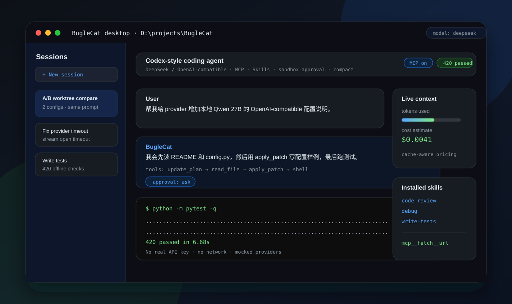

# nanocodex

[English](README.md) | 简体中文

## 能力说明页

[打开在线能力说明页](https://dgy-github.github.io/nanocodex/nanocodex.html) · [查看仓库内 HTML](nanocodex.html)

[设计说明 PDF](docs/ai-coding-agent-design-brief.pdf) · [设计说明 HTML](docs/ai-coding-agent-design-brief.html)

[](https://dgy-github.github.io/nanocodex/nanocodex.html)

`nanocodex` 是一个小而完整的 Codex 风格编码 agent。一个 chat-completions 模型
提出工具调用，agent 在沙箱内执行文件/shell 工具，记录会话，并循环直到任务完成。
它可以对接 DeepSeek 托管 API，也可以对接任意 OpenAI 兼容的本地模型，并自带
MCP 集成、skills 系统、沙箱/审批状态机、上下文压缩、token 成本统计、Windows
GUI、定时器，以及 git worktree 的 A/B 对比。

项目分为两个清晰阶段。重点不是“把同一套功能换一种语言写”，而是架构边界和发布性能的
升级。

## 项目阶段

### 第一阶段：Python 基础版

`nanocodex/` 下的 Python 实现是最早的完整功能线，目标是快速验证产品形态：先把
agent 循环、工具体验、审批模型和桌面流程跑通，再决定哪些部分需要更强的工程边界。

**架构层面**

- 以一个紧凑的 async agent loop 为中心：调用模型 -> 执行工具 -> 更新 session ->
  进入下一轮模型调用。
- 工具、provider、sandbox、MCP、skills、memory、scheduler、compaction、GUI 都是
  可独立扩展的 Python 模块，适合在产品形态还不稳定时快速迭代。
- 运行时契约偏动态，因此新增 MCP marketplace、prompt 增强、图片输入、session
  resume/fork、A/B worktree 对比等功能成本很低。
- Windows GUI 使用 Tkinter，第一版桌面体验依赖少、调试直接。

**性能与交付层面**

- 优势是迭代速度：没有编译步骤，实验快，mock provider 的离线测试也容易铺开。
- 420 个离线测试覆盖 Python 功能线，不需要真实 API key，也不依赖网络。
- 交付仍依赖 Python 解释器、包环境和导入启动成本；对普通 Windows 用户来说，分发
  体验不如原生二进制直接。
- 动态边界适合探索期，但当沙箱、工具执行、记忆、MCP、并行 agent flow 变多时，跨模块
  状态和行为边界会越来越难推理。

### 第二阶段：Rust 重构版

`rust/` 下的 Rust 实现是当前 release 线。它不删除 Python 树，而是把已经验证过的
能力重建成更清晰的 crate 边界，并配套 Tauri 桌面壳，让项目进入可分发工具阶段。

**架构层面**

- 工作区按责任拆分为 `ncx-sandbox`、`ncx-config`、`ncx-provider`、`ncx-tools`、
  `ncx-core`、`ncx-cli`。
- provider 响应、工具调用、沙箱决策、session 消息、记忆条目、编排结果都有显式类型，
  跨 crate 边界时不再靠松散 dict/object 传递。
- 工具执行集中到 `ToolContext` 和 `ToolRegistry` 后面，沙箱策略、审批策略、超时、
  搜索和记忆都挂在真正执行动作的边界上。
- 编排层加入任务分类、main/fast 模型路由、隔离 worker 工作区、verifier 选择，以及
  把胜出 worker promote 回真实工作区。
- 项目记忆保存在 `.ncx/memory/LEARNINGS.md`；启动时只做便宜的启发式去重，显式运行
  `ncx --memory-merge` 才会做成本更高的 LLM 记忆合并。
- 桌面线切到 Tauri v2 + Svelte 5，把原生后端和 UI 表层分离，为比 Python GUI 更小的
  release bundle 做准备。

**性能与交付层面**

- CLI 构建成原生 `ncx.exe`，用户不需要准备 Python、虚拟环境或 editable install。
- release 构建启用 strip、LTO、体积优化，并面向 Windows GNU target；当前 CLI zip
  小于 2 MB，且已经包含 README、LICENSE 和配置样例。
- 启动路径避开 Python 解释器和 import 开销，适合短的一次性命令，也适合交互 REPL。
- 显式所有权让并行 worker 隔离、结果选择和 promote 更容易推理，不容易出现共享可变状态
  泄漏。
- 174 个 Rust 离线测试覆盖当前 crate 边界，包括记忆合并、provider 请求/响应解析、
  沙箱策略、工具和编排器。

### 第二阶段为什么改用 Rust

切到 Rust 是因为第二阶段的目标是产品化，而不只是继续加功能：

- **架构硬化：** 沙箱、审批引擎、provider adapter、工具注册表、记忆存储和编排器都有
  显式类型契约，不再主要依赖 Python 的动态对象边界。
- **动作边界更清楚：** 文件、shell、搜索、记忆操作都经过同一个 tool context，审批和
  沙箱检查贴近真实执行点。
- **并行编排更稳：** 隔离 worker 副本、verifier 选择、结果 promote 回真实工作区这些
  流程，在显式所有权和类型系统下更容易证明不会互相踩写。
- **原生发布性能：** 小体积 `ncx.exe` 不需要解释器启动和环境配置，一次性 CLI 任务响应
  更直接，Windows 用户拿到包即可运行。
- **桌面打包路径：** Tauri 提供原生 shell + web UI 前端，比继续扩大 Tkinter 原型更适合
  长期发布。

## 目录

- [项目阶段](#项目阶段)
- [亮点](#亮点)
- [架构](#架构)
- [工具](#工具)
- [安装](#安装)
- [快速开始](#快速开始)
- [配置](#配置)
- [本地模型 / OpenAI 兼容接口](#本地模型--openai-兼容接口)
- [沙箱与审批](#沙箱与审批)
- [MCP](#mcp)
- [Skills](#skills)
- [记忆与 AGENTS.md](#记忆与-agentsmd)
- [会话、恢复与历史](#会话恢复与历史)
- [上下文压缩](#上下文压缩)
- [Token 用量与成本](#token-用量与成本)
- [定时器](#定时器)
- [A/B worktree 对比](#ab-worktree-对比)
- [GUI](#gui)
- [测试](#测试)
- [安全说明](#安全说明)

## 亮点

- **Codex 风格 agent 循环** —— 流式 token 输出、多轮工具调用、可取消、按轮统计
  用量。
- **DeepSeek + 任意 OpenAI 兼容后端** —— 把 `base_url` 指向托管 API 或本地服务
  （vLLM、llama-server、LM Studio……）。
- **沙箱与审批状态机** —— 三种沙箱模式、四种审批策略，拦截每一次文件/shell/网络
  动作。
- **MCP 集成 + 市场** —— 从 `mcp.toml` 加载服务，或从内置 / 远程目录一键安装；
  工具以 `mcp__<server>__<tool>` 形式暴露。
- **Skills 系统** —— 用户 skill 加三个内置编码 skill；只注入名称 + 描述，正文
  按需加载。
- **持久记忆 + AGENTS.md** —— 每轮注入的持久个人笔记和分层的项目指令。
- **可浏览的会话历史** —— JSONL 日志、完整对话快照、恢复（resume）和分叉（fork）。
- **上下文压缩** —— 零成本的确定性摘要，或可选的模型摘要，按 token 预算触发。
- **缓存感知的成本统计** —— 用真实的按调用用量，按 DeepSeek 的命中/未命中费率
  计价。
- **自适应推理强度** —— `auto` 档根据请求选 `max`/`high`/`low`（多语言关键词表：
  英文 / 中文 / 日本語）。
- **定时器** —— 一次性/周期性保存的 prompt，连续失败自动禁用。
- **A/B worktree 对比** —— 同一 prompt 在两个隔离的 git worktree 里各跑一套配置，
  对比 diff/成本/延迟，采纳其中一侧。
- **prompt 增强、图片输入、中文优先回复**，以及一个面向 Windows 的 Tkinter GUI。

## 架构

```text
nanocodex/
├── agent/
│   ├── loop.py            # 轮次循环：调模型 → 跑工具 → 重复
│   ├── prompt.py          # 基础系统提示（中文优先沟通）
│   ├── session.py         # 运行中的消息列表 + JSONL 持久化
│   ├── session_index.py   # 可浏览的历史索引 + 单会话快照
│   ├── compaction.py      # 把 prompt 压在 token 预算内
│   ├── pricing.py         # 从真实用量算缓存感知的美元成本
│   ├── auto_reasoning.py  # 为 `auto` 档选推理强度
│   ├── enhance_prompt.py  # ✨ 把原始输入改写成更清晰的 prompt
│   ├── memory_store.py    # ~/.nanocodex/memory.md 持久笔记
│   ├── agents_md.py       # 分层的 AGENTS.md 项目指令
│   ├── images.py          # OpenAI 多模态图片块
│   ├── skills_store.py    # 用户 + 内置 skills 发现
│   ├── schedule.py        # 定时任务存储（一次性 / 周期）
│   ├── schedule_runner.py # 触发到期任务，跟踪失败
│   └── ab_compare.py      # A/B worktree 对比（纯逻辑核心）
├── provider/
│   ├── base.py            # Provider / ToolCall / ModelResponse 契约
│   └── deepseek.py        # OpenAI 兼容的 chat-completions + 流式
├── tools/                 # shell、apply_patch、update_plan、read_file、
│                          # web_search、schedule、skills、remember、
│                          # mcp、mcp_store、marketplace、patch
├── sandbox/
│   ├── policy.py          # 什么可写 / 是否允许网络
│   ├── approval.py        # ASK / AUTO_APPROVE / AUTO_DENY 状态机
│   └── executor.py        # 工具边界上的策略级强制
├── builtin_skills/        # code-review、debug、write-tests
├── cli.py                 # CLI 入口（typer）
├── gui.py                 # Tkinter GUI
└── config.py              # 分层配置解析
```

## 工具

模型每轮看到这些工具（顺序有意义）：

| 工具 | 用途 |
| --- | --- |
| `shell` | 执行 shell 命令，受沙箱/审批策略约束。 |
| `apply_patch` | 应用 Codex 风格补丁，创建/编辑/删除文件。 |
| `update_plan` | 为多步任务维护一个可见的步骤计划。 |
| `read_file` | 读取工作区里的文件（或某个行区间）。 |
| `web_search` | DuckDuckGo 搜索，受网络策略约束。 |
| `manage_schedule` | 在对话里创建 / 列出 / 取消定时任务。 |
| `manage_skills` | 在对话里创建 / 列出 / 读取 / 删除用户 skill。 |
| `remember` | 往用户记忆里追加一条持久笔记。 |
| `mcp__<server>__<tool>` | 已连接 MCP 服务暴露的任意工具。 |

## 安装

```powershell
cd path\to\nanocodex
python -m pip install -e ".[dev]"
```

需要 Python ≥ 3.11。

## 快速开始

Rust CLI，当前 release 线：

```powershell
cd rust
cargo run -p ncx-cli -- "summarize this repository"
cargo run -p ncx-cli
cargo run -p ncx-cli -- --memory-merge
```

Python CLI，原始功能线：

```powershell
# 一次性任务
nanocodex "add a --json flag to the CLI"

# 在当前目录交互
nanocodex --cd .

# 启用 MCP 服务
nanocodex --mcp

# 启动 GUI
nanocodex-gui --cd .
```

在 Windows 上，安装后也可以直接双击 `nanocodex-gui.cmd`，或用
`scripts/make-shortcut.ps1` 生成开始菜单快捷方式。

## 配置

配置项按优先级解析：

```text
CLI 参数 > 环境变量 > ~/.nanocodex/config.toml > ~/.deepseek/config.toml > ~/.codex/config.toml > 默认值
```

真实 API key 应当留在仓库之外：

```powershell
$env:DEEPSEEK_API_KEY = "sk-..."
$env:NANOCODEX_API_KEY = "sk-..."
```

或创建 `~/.nanocodex/config.toml`：

```toml
api_key = "sk-..."
base_url = "https://api.deepseek.com/v1"
model = "deepseek-chat"

sandbox_mode = "workspace-write"   # read-only | workspace-write | danger-full-access
approval_policy = "on-request"     # untrusted | on-failure | on-request | never
reasoning_effort = "auto"          # auto | low | high | max | off

# 可选
# context_token_budget = 512000
# context_window = 1048576
# available_models = ["deepseek-chat", "deepseek-reasoner", "deepseek-v4-pro"]
```

完整示例见 `config.example.toml`。

## 本地模型 / OpenAI 兼容接口

nanocodex 走标准的 `/v1/chat/completions`，所以任何 OpenAI 兼容服务都能用——
vLLM、llama-server、LM Studio、Ollama 的 OpenAI 兼容层等等。把 `base_url`
指向该服务的 `/v1` 根路径即可。多数本地服务会忽略 API key，但仍需一个非空占位
值，因为 OpenAI SDK 需要它。

```toml
api_key = "local-dev-key"
base_url = "http://127.0.0.1:8005/v1"
model = "Qwen3.6-27B-Q4_K_M"
```

快速连通性检查：

```powershell
curl http://127.0.0.1:8005/v1/models
```

流式有一个有界的「响应头」超时（默认 45 秒，可用
`NANOCODEX_STREAM_OPEN_TIMEOUT_S` 覆盖），这样卡住的本地服务会带清晰提示快速
失败，而不是把 UI 一直挂住。

## 沙箱与审批

两个正交维度拦截每一次动作，对齐 Codex：

**沙箱模式** —— 物理上允许什么：

| 模式 | 读 | 写 | 网络 |
| --- | --- | --- | --- |
| `read-only` | 任意 | 无 | 关 |
| `workspace-write` | 任意 | 工作区 + 可写根 + 临时区 | 默认关，可显式开 |
| `danger-full-access` | 任意 | 任意 | 开 |

**审批策略** —— 动作超出沙箱时怎么办：`untrusted`、`on-failure`、`on-request`、
`never`。审批引擎把每次越权解析为 `ASK` / `AUTO_APPROVE` / `AUTO_DENY`。

在 Windows 上强制是**策略级**的：路径检查和可写根拦截发生在工具边界，不是内核级
隔离。

## MCP

MCP 服务是可选的（opt-in），并且运行在沙箱**之外**（它们会启动外部子进程）。在
`~/.nanocodex/mcp.toml` 里配置：

```toml
[mcp_servers.fetch]
command = "uvx"
args = ["mcp-server-fetch"]

[mcp_servers.filesystem]
command = "npx"
args = ["-y", "@modelcontextprotocol/server-filesystem", "D:\\projects"]
```

然后以启用 MCP 的方式启动：

```powershell
nanocodex --mcp
```

每个服务的工具以 `mcp__<server>__<tool>` 暴露给模型。一个**市场**支持从内置精选
目录或远程目录（`NANOCODEX_MARKETPLACE_URL`）一键安装；每个条目都走和手动添加
服务相同的名称校验与去重，远程目录被当作不可信数据处理。更多见
`mcp.example.toml`。

## Skills

Skills 是可复用的指令文档，每个一个目录：

```text
~/.nanocodex/skills/<skill-name>/SKILL.md
```

只有每个 skill 的**名称和描述**会被注入系统提示；完整正文按需读取，所以一个庞大
的库不会吃掉上下文窗口。模型也可以通过 `manage_skills` 工具在对话里创建/读取/
删除用户 skill。

最小 skill：

```markdown
---
name: code-review
description: Review code changes and focus on bugs, regressions, and missing tests.
---

# Code Review

Look for behavior regressions first, then missing tests, then maintainability.
```

包内自带三个**只读内置 skill**，位于 `nanocodex/builtin_skills/`：

- **code-review** —— 两遍审查（先正确性，再清理），按影响排序。
- **debug** —— 复现 → 定位 → 修复 → 验证；克制住「补第一处看似合理的行」的冲动。
- **write-tests** —— 测可观察行为，一个测试一个行为，优先纯函数而非 mock。

同名的用户 skill 会遮蔽内置的。

## 记忆与 AGENTS.md

两层互补的持久上下文，每轮都注入：

- **用户记忆**（`~/.nanocodex/memory.md`）—— 持久的个人事实和偏好。由 `remember`
  工具写入、在 GUI 输入框里打 `# 内容` 快速捕获、或手工编辑。包在 `<user_memory>`
  块里。
- **AGENTS.md** —— 项目指令，从 `~/.codex/AGENTS.md` 一路分层到从仓库根到工作区
  的每个 `AGENTS.md`，所以嵌套目录可以细化父级。总大小有上限，避免一个超大文件
  撑爆上下文。

记忆讲「谁/什么」（偏好、事实）；skills 讲「怎么做 X」；AGENTS.md 是项目级指引。

## 会话、恢复与历史

- 每个对话都追加进一个 **JSONL 会话日志**（base64 图片数据会从日志里抹掉以保持
  精简）。
- 一个**全局索引**（`~/.nanocodex/sessions.jsonl`）每个对话存一行摘要，最新在前，
  供 GUI 的历史列表使用。
- 一个**单会话快照**（`~/.nanocodex/snapshots/<id>.json`）冻结完整对话，所以详情
  视图回放的是真实对话，而非摘要。
- `--resume` 续接之前的会话；GUI 可以**分叉（fork）**一个会话来分支历史。

## 上下文压缩

长对话会被折叠以保持在 token 预算内，同时保留系统消息和最近一段尾部（尾部总是从
一条 `user` 消息开始，所以不会切断 tool-call/result 对）。两种策略共用一个接口：

- **deterministic（默认，零 API 成本）** —— 被折叠的中段变成事实性的、基于规则的
  摘要。
- **summarizer（可选，消耗 token）** —— 一次模型调用把中段写成散文。

触发估算用偏中文的 chars/token 比例，所以中文为主的对话不会压缩得太晚。

## Token 用量与成本

provider 每次调用返回真实 `usage`，包含 DeepSeek 的缓存命中/未命中拆分。
`pricing.py` 把它折算成美元成本：

- **缓存感知** —— 一个缓存命中的输入 token 比未命中便宜约 120×；各按自己的费率
  计价。拆分缺失时，整段 prompt 按未命中费率计，所以成本永不低估。
- **对陈旧诚实** —— 价格是一份硬编码快照，带来源和「截至日期」；未知模型返回
  「成本未知」而不是一个错误数字。

## 定时器

把一个 prompt 存起来自动运行——一次性在某个未来时间，或按间隔周期运行：

```powershell
nanocodex schedule add "run the tests" --at 2026-06-08T09:00:00
nanocodex schedule add "summarize new issues" --every 3600
nanocodex schedule list
nanocodex schedule run        # 让它一直跑，任务才会触发
```

连续失败 5 次的任务会**自动禁用**（成功会重置计数器；重新启用会清零），所以一个
坏掉的任务不会永远循环。模型也可以通过 `manage_schedule` 在对话里管理任务。

## A/B worktree 对比

用**两套配置跑同一个 prompt**并对比结果，且不冒着破坏工作树的风险。每一侧都在自己
隔离的 **git worktree** 里跑，所以真实的 `shell`/`apply_patch` 改动永不冲突：

1. 选两套配置（model / 推理强度 / 沙箱 / 审批）。
2. nanocodex 从干净的 `HEAD` 建两个 worktree，串行地在每个里跑这个 prompt，
   审批 auto 放行但范围锁在 worktree 内。
3. 你拿到并排对比：diff、token 成本、延迟、迭代步数、停止原因。
4. **采纳**其中一侧（它的 diff 被应用到真实工作区），或两侧都丢弃；worktree 总会
   被清理。

要求工作区是干净的 git 仓库（无未提交改动），否则入口禁用。

## GUI

一个面向 Windows 的 Tkinter 桌面 GUI（`nanocodex-gui`）：

- 流式对话，推理/答案分离，带 Stop 按钮。
- 项目切换、模型切换，以及多分区的设置页。
- 可浏览的会话历史（点击回放完整对话）。
- 文件面板、prompt 增强（✨）、图片附件、`#` 快速捕获到记忆、MCP 自动连接、
  定时器控制，以及 A/B 对比流程。

注意：GUI 不热加载——改代码需要关掉再重开。

## 测试

Rust release 线：

```powershell
cd rust
cargo test --workspace --target x86_64-pc-windows-gnu
```

Python 线：

```powershell
python -m pytest -q
```

两套测试都完全离线：mock 过的 provider、可注入的 I/O，不需要真实 API key 或网络
请求。

## Release 打包

Windows GNU CLI release：

```powershell
cd rust
cargo build --release --workspace --target x86_64-pc-windows-gnu
```

Tauri 桌面 release：

```powershell
cd rust\gui
npm.cmd install
npm.cmd run build
npx.cmd @tauri-apps/cli@latest build --target x86_64-pc-windows-gnu
```

Tauri crate 特意保留 `crate-type = ["lib"]`；改成 `cdylib` 或 `staticlib` 会让
Windows GNU 链接器的 export ordinal 表溢出。

## 安全说明

- **绝不提交真实 API key。** `.env`、`*.key`、`*.pem`、token 文件以及本地交接文件
  都被 git 忽略；`config.toml` / `mcp.toml` 放在 `~/.nanocodex/`，在仓库之外。
- 在 Windows 上沙箱是**策略级**的——它拦截工具行为和可写根，但不是内核级隔离。
- **MCP 工具运行在沙箱之外**，作为外部子进程。只启用你信任的服务；市场会校验
  名称但不审查行为。
- 外部内容（文件内容、命令输出、web/MCP 结果）被当作不可信数据，而非指令。

## 许可证

MIT —— 见 [LICENSE](LICENSE)。
