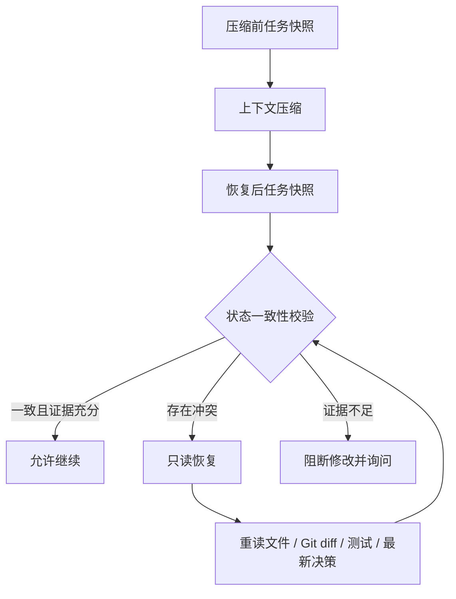

# 上下文压缩后，AI Coding Agent 为什么会“把删掉的代码加回来”？

> 从任务状态快照、决策溯源到压缩前后一致性校验

长时间运行 Coding Agent 时，我们通常把“上下文不够”理解成一个 Token 优化问题：历史太长，就摘要、裁剪，再继续执行。

但在一次真实的 BugleCat 开发中，我遇到了一个更危险的问题：Agent 已经按要求删除了一段代码，上下文压缩后却失去了“删除已经完成”这一任务状态，恢复执行时又把代码加了回来。

这不是普通的摘要质量问题。对会修改工作区的 Agent 来说，上下文压缩实际上是一次**任务状态迁移**。如果迁移前后的状态无法校验，Agent 就可能带着错误的目标、过期的决策或丢失的禁止事项继续写代码。

本文提出一套用于 Coding Agent Harness 的外部保护层：

**Context Compression Safety Protocol（上下文压缩安全协议）**。

它的核心观点是：

> 压缩后的摘要只能帮助 Agent 恢复方向，不能成为代码事实源。是否允许继续修改，必须重新核对工作区、Git diff、测试结果和最近一次有效决策。

## 一个典型的状态漂移事故

把事故抽象成最小过程，大致是这样：

1. 用户要求删除某段旧实现，并明确“不要恢复”。
2. Agent 修改文件并验证删除结果。
3. 长会话达到上下文阈值，旧消息被摘要或裁剪。
4. 压缩结果保留了早期讨论，却遗漏“删除已完成”和“不要恢复”。
5. Agent 根据残留的早期方案继续工作。
6. 它看到调用方缺少实现，误以为代码被意外删掉，于是重新补回。

从文本角度看，第 6 步甚至可能“逻辑通顺”；从任务状态角度看，它却违反了最新决策。

普通对话摘要很难阻止这类错误，因为它无法回答几个关键问题：

- 这段代码当前不存在，是任务结果还是意外缺失？
- “删除”是讨论中的提案，还是已经确认并执行的决策？
- 后续有没有新指令替代旧方案？
- 压缩期间工作区是否发生变化？
- 最近的测试证据对应压缩前还是压缩后？

因此，问题不能只靠“写一个更好的摘要 Prompt”解决。

## 相近方案解决了什么，又缺少什么

这个方向并非没有前置工作。已有工程实践提供了很多可以复用的部件，但关注点并不完全相同。

### LangGraph checkpointing

LangGraph 的 checkpointing 保存图执行状态，使 Agent 可以中断、恢复和回放。它非常适合解决“运行到哪里了”，但 checkpoint 本身并不自动证明恢复后的自然语言任务状态与当前 Git 工作区一致。

### Letta / MemGPT 分层记忆

Letta、MemGPT 将上下文分成核心记忆、短期上下文和归档记忆，解决有限上下文中的信息分层问题。但“什么值得长期保留”和“恢复后是否仍允许写代码”是两个不同问题。记住一条决策，不等于验证这条决策仍与工作区事实相符。

### 事件溯源和状态机

事件溯源不覆盖旧状态，而是保存事件顺序，再从事件重建当前状态。这为“提出方案 → 确认 → 修改 → 验证 → 后续替代”提供了合适模型。不过 Coding Agent 还需要把决策事件连接到文件、diff 和测试证据。

### 交接文件与 Git 验证

许多 Coding Agent 项目会维护任务清单、交接文件和 `git diff`。这些内容能帮助恢复工作，却往往依赖 Agent 自觉读取；如果压缩后的 Agent 直接进入写操作，交接文件不会自动形成安全边界。

### 模型或产品内部的上下文压缩

Codex、Claude Code 等工具会在长任务中压缩上下文，以便继续会话。但上游压缩算法通常不是本地 Harness 能直接修改的，而且其内部摘要也不应该被当作当前代码状态的权威来源。

因此，本文方案并不是替代 checkpoint、长期记忆或事件溯源，而是把它们与工作区验证组合成一个**写操作门禁**。

## 协议总览



这里最重要的变化是：压缩不再是一个透明的文本优化步骤，而是一个有前置快照、后置校验和失败策略的状态转换。

## 机制一：压缩前任务快照

压缩前应提取结构化任务状态，而不是只生成一段自然语言摘要。最小快照应包含：

- 原始要求；
- 已确认方案；
- 明确禁止事项；
- 已完成与未完成事项；
- 当前涉及文件；
- 当前提交号及 Git diff 摘要或指纹；
- 最近一次有效测试结果。

示例：

```json
{
  "schemaVersion": 1,
  "capturedAt": "2026-08-28T15:20:00+08:00",
  "task": {
    "originalRequirements": [
      "删除旧的 provider fallback 实现"
    ],
    "confirmedDecisions": [
      {
        "id": "D17",
        "status": "confirmed",
        "text": "只保留原子 Provider Route，不恢复旧 fallback"
      }
    ],
    "prohibitions": [
      "不要恢复已删除的 fallback",
      "不要提交到旧 nanocodex 仓库"
    ],
    "completed": [
      "旧 fallback 已删除"
    ],
    "pending": [
      "运行 provider-switch E2E"
    ]
  },
  "workspace": {
    "head": "86ec27e",
    "files": [
      "rust/crates/ncx-config/src/provider_directory.rs"
    ],
    "diffStat": "1 file changed, 18 deletions(-)",
    "diffFingerprint": "sha256:example-redacted"
  },
  "tests": [
    {
      "command": "cargo test -p ncx-config",
      "result": "passed",
      "head": "86ec27e"
    }
  ]
}
```

快照中不应保存 Token、Cookie、私钥或完整敏感业务内容。测试证据还应绑定提交号或工作区指纹，避免把旧测试结果错误地套到新代码上。

## 机制二：按优先级压缩

对 Coding Agent 而言，不同消息的丢失代价并不相同。推荐的保留优先级是：

```text
用户最新纠正
  > 已确认决策
  > 禁止事项
  > 当前代码状态
  > 测试证据
  > 普通讨论
```

尤其是下面这些表达，应该进入不可丢失约束，而不是被当作普通对话：

- 不要删除；
- 不要恢复；
- 不要提交；
- 先别改；
- 当前会话也要生效；
- 新方案替代旧方案。

这并不意味着关键词匹配就足够。关键词可以作为第一版实现，但成熟协议需要结构化确认、来源引用和冲突语义。

## 机制三：决策事件不可覆盖

只保存一份“当前摘要”会抹掉决策如何变化。更稳妥的方式是记录不可变事件：

```text
D12 提出：删除旧实现
  -> D13 确认：执行删除
  -> A08 修改：删除 file.rs 中的旧分支
  -> V05 验证：定向测试通过
  -> D17 替代：保留兼容解析，但仍禁止恢复旧执行路径
```

后续指令改变方案时，应新增“替代旧决策”事件，而不是覆盖 D13。这样恢复时既能知道最初要求，也能知道哪个决定当前有效。

## 机制四：引用树连接语言与代码事实

任务状态不能悬浮在聊天记录里。完整版协议应建立这样的引用关系：

```text
任务 T1
├── 决策 D13
│   ├── 修改 A08
│   │   ├── 文件 file.rs
│   │   └── diff hunk H3
│   └── 验证 V05
│       ├── 测试命令
│       └── 工作区指纹
└── 后续决策 D17（替代 D13 的一部分）
```

引用树的价值不是让记录更复杂，而是让 Agent 在恢复时能提出可验证的问题：“D17 是否允许恢复 H3 删除的代码？”如果证据链无法回答，就不应该直接写入。

## 机制五：压缩前后一致性校验

压缩完成后，重新生成同结构快照，并逐项对比：

- 任务目标是否缺失或改变；
- 当前有效决策是否一致；
- 禁止事项是否仍存在；
- 文件范围是否异常变化；
- 已完成状态是否倒退；
- 待执行动作是否被错误重置；
- Git diff 或工作区指纹是否在压缩期间改变；
- 测试证据是否仍指向同一代码状态。

校验结果至少分为三类：

```rust
enum RecoveryDisposition {
    Continue,
    ReadOnlyRecovery { conflicts: Vec<Conflict> },
    Blocked { missing_evidence: Vec<EvidenceKind> },
}
```

`Continue` 只表示安全检查未发现冲突，不代表代码一定正确；`ReadOnlyRecovery` 允许搜索、读文件、查看 Git 和运行只读诊断，但禁止修改；`Blocked` 则需要用户确认或新的可靠证据。

## 为什么冲突时必须先只读

检测到不一致后，如果仍让 Agent 继续使用 `apply_patch`、写文件或执行有副作用的命令，校验就只是一条警告。

真正的安全边界应落在工具执行层：

```rust
if recovery_mode.is_read_only() && !tool.is_read_only() {
    return Err("压缩状态存在冲突：请先核对工作区、diff、测试和最新决策");
}
```

只读恢复阶段应完成：

1. 重读受影响文件，而不是依赖摘要中的代码片段；
2. 检查 `git status`、`git diff` 和当前提交；
3. 核对最近一次有效决策及其替代关系；
4. 重新运行与冲突范围匹配的测试；
5. 证据一致后显式解除只读状态。

解除门禁也不应仅由模型说“我已经检查过”触发，而应由 Harness 根据实际工具结果或用户确认完成。

## BugleCat 当前实现到了哪里

BugleCat 已实现这一协议的第一版外部保护层：

- `CompactionSafetySnapshot` 提取原始要求、已确认决策、禁止事项、完成/待办、文件、diff 摘要和测试文本；
- 已确认决策带顺序编号，包含“替代、改为、后来、不再”等表达时标记为“替代旧决策”；
- 压缩前写入安全里程碑，明确声明摘要不是代码事实源；
- 压缩后比较任务目标、决策、禁止事项、文件与 `git diff` 状态；
- 一旦发现冲突，在工具执行层阻断非只读工具；
- Agent 被要求重新读取工作区、Git diff、测试和最新有效决策。

实现入口主要位于：

- `rust/crates/ncx-core/src/session.rs`：快照、里程碑和一致性比较；
- `rust/crates/ncx-core/src/agent_loop/turn.rs`：冲突后进入只读恢复；
- `rust/crates/ncx-core/src/tools/execution.rs`：写工具门禁。

当前版本仍是工程原型，不应被描述为已经解决了所有压缩状态漂移问题。它还有明确的演进空间：

- 当前决策识别仍以规则和关键词为主；
- 当前工作区证据主要是 `git diff --stat`，还不是稳定的内容级指纹；
- 文件引用来自会话文本提取，尚未形成完整的代码区块引用树；
- 测试结果仍需要更强的命令、退出码、提交号和时间绑定；
- 只读恢复后的自动解锁条件需要进一步结构化。

## 这不是在修改 Codex 的内部压缩算法

必须明确区分三层能力：

1. **上游模型或 Codex 内部压缩算法**：本地项目通常无法直接修改；
2. **Agent Harness、MCP 和会话层**：可以捕获压缩前后的状态，并控制工具权限；
3. **项目记忆层**：可以保存长期决策和交接信息，但不能替代仓库事实。

本文方案位于第 2 层，并按需引用第 3 层。它不承诺摘要永远正确，而是假设摘要可能出错，然后用工作区证据限制错误的破坏范围。

## 如何验证这套协议

除了普通单元测试，还应加入针对“状态漂移”的故障注入：

- 压缩时删除最新禁止事项，预期进入只读恢复；
- 把“已删除”改写成“待删除”，预期识别完成状态倒退；
- 在压缩窗口内改变 Git diff，预期阻断写操作；
- 保留旧决策但丢失替代事件，预期判定当前决策不完整；
- 伪造摘要中的测试通过，但工作区指纹不同，预期测试证据失效；
- 只读恢复期间调用写工具，预期在执行层失败；
- 重新核对证据并由 Harness 解锁后，预期恢复正常执行。

更进一步，可以建立一个专门评测集：给定同一份压缩前状态，随机丢弃、改写或重排摘要字段，测量系统发现冲突和阻止错误写入的能力。

## 结语

长任务 Coding Agent 的可靠性，不只取决于模型能记住多少内容，也取决于系统能否证明“恢复后的任务状态仍然可信”。

Checkpoint 解决运行恢复，分层记忆解决信息存放，事件溯源解决决策历史，Git 和测试提供代码证据。Context Compression Safety Protocol 把这些能力连接起来，并在证据不一致时把风险收敛到只读范围。

它不要求压缩摘要绝对正确。恰恰相反，它从一个更现实的假设出发：

> 摘要一定可能丢信息，所以任何恢复后的写操作都应建立在可重新验证的事实之上。

这可能比继续优化摘要 Prompt 更接近 Coding Agent 长任务可靠性的核心。

## 相关资料

- [LangGraph persistence / checkpointing](https://docs.langchain.com/oss/python/langgraph/persistence)
- [Letta memory management](https://docs.letta.com/guides/agents/memory)
- [Martin Fowler: Event Sourcing](https://martinfowler.com/eaaDev/EventSourcing.html)
- [Git diff documentation](https://git-scm.com/docs/git-diff)
